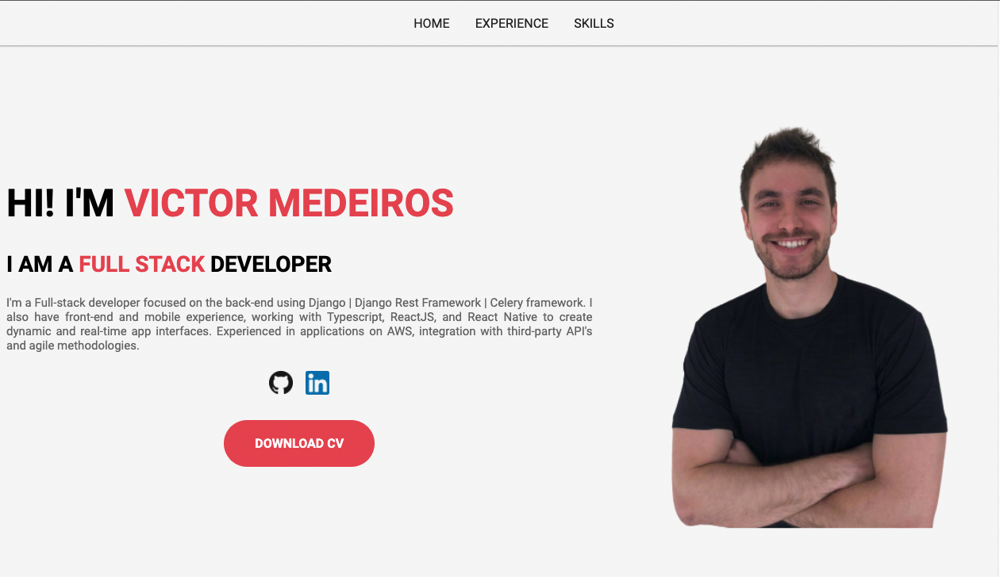

<div align="center">
     <h1>Personal Site</h1>
</div>

<p align="center">
  <a href="#-technologies">Technologies</a>&nbsp;&nbsp;&nbsp;|&nbsp;&nbsp;&nbsp;
  <a href="#-project">Project</a>&nbsp;&nbsp;&nbsp;|&nbsp;&nbsp;&nbsp;
  <a href="#-license">License</a>
</p>

<p align="center">
  
  
  

  
</p>

<br>

<div align="center">
  
</div>

---

## 🧪 Technologies

This project was developed using the following technologies:

-   [HTML]
-   [CSS]

## 🚀 Getting started

Clone the project and access the folder

```bash
$ git clone https://github.com/victortxc/personal-site-FIAP-1.git && cd personal-site-FIAP-1
```
## 💻 Project

Personal site.

This is a project developed during my graduation at **[FIAP](https://www.fiap.com.br/)**.

## 📝 License

This project is licensed under the MIT License. See the [LICENSE](LICENSE.md) file for details.

